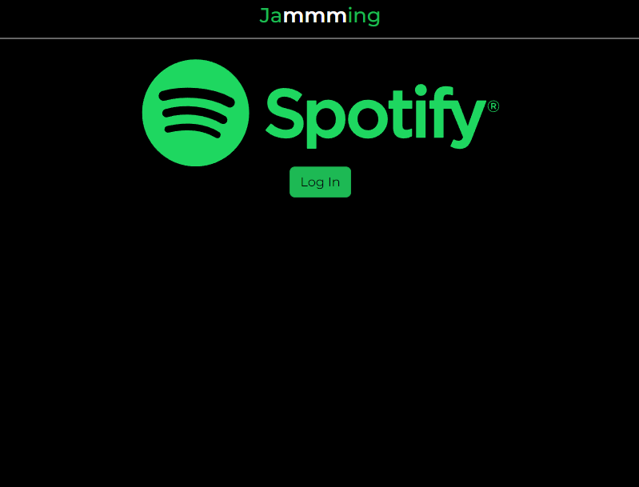
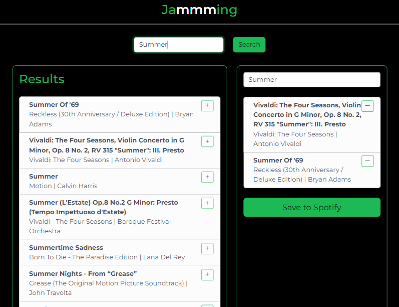

# Jamming page
This project is focused on developing a React application by applying learnings from a Web Development course. The project utilizes the React library to build a Spotify-integrated application that authenticates users via OAuth, facilitating access to their Spotify account. Users are able to search for songs, select their favorites, and create a custom playlist.

## Features
- **OAuth Authentication**: Securely authenticates users with Spotify, granting the application access to account data for playlist creation.
- **Music Search**: Allows users to search the Spotify library for tracks, viewing real-time results.
- **Playlist Creation**: Users can create a new playlist by selecting songs from their search results and save them directly to their account.
- **Responsive Design**: Implements a mobile-first design approach, ensuring the application is responsive on multiple devices.

#### Images



## Technologies Used
Technologies
- React & JSX: For building the user interface with component-based architecture.
- TypeScript: Adds type safety to improve code quality.
- HTML5 & CSS3: For structuring and styling the application.
- Netlify: Utilized for deploying the static site.

## Set up
You can directly open the Jammming app [here](https://jammming-fe-project.netlify.app).
To run the code locally, you can follow the next steps:
1. Clone this repository using the following command:
```bash
git clone https://github.com/Joel-Milla/Jammming.git
```
2. Install the required dependencies.
```bash
npm install
```
3. Launch the application.
```bash
npm run dev
```

## Contribution
Feel free to fork the repository and submit pull requests to contribute to this project. Any contributions are welcome!
